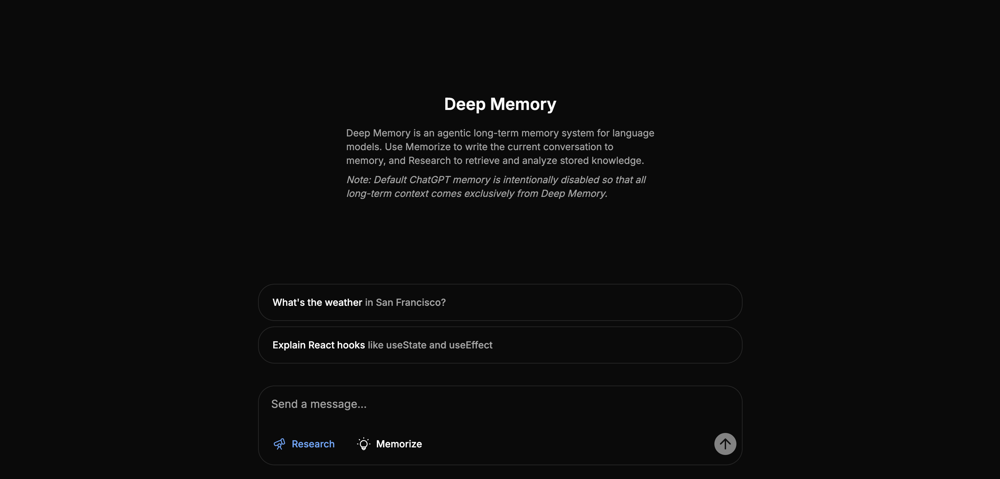

# Deep Memory

An agentic long-term memory system for language models that enables AI assistants to store, retrieve, and intelligently process conversational context across sessions.



**Live Demo:** https://deep-memory.vercel.app/

## Overview

Deep Memory extends language models beyond single-session context windows by providing persistent memory capabilities. Unlike traditional memory systems that compress information ahead-of-time (AOT), Deep Memory follows a **just-in-time (JIT) compilation** approach: it maintains complete conversation history in a searchable page-store while performing intensive "deep research" at query time to retrieve and synthesize exactly the information needed.

This design avoids the information loss inherent in pre-compressed memory systems, enabling high-fidelity retrieval and task-adaptive context generation.

## Architecture

Deep Memory implements a dual-agent framework with four specialized components:

### Memorizer Agent

Processes conversations into two complementary forms:

**Lightweight Memory**
- Generates concise abstracts highlighting key information from each session
- Enables fast preliminary searches across conversation history

**Complete Page-Store**
- Preserves full conversation content with contextual headers
- Ensures accurate retrieval without information loss

**Storage Implementation**
- Four Pinecone indexes for multi-modal search
- Dense indexes using semantic embeddings (text-embed-v2)
- Sparse indexes using keyword matching (pinecone-sparse-english-v0)

### Researcher Agent

Performs deep research through three phases:

**Planning**
- Analyzes queries and existing memory to determine information needs
- Selects optimal search strategies (keyword, vector, hybrid, or image)

**Searching**
- Executes planned searches across the page-store
- Retrieves relevant conversations using multiple search modalities

**Integration**
- Synthesizes retrieved information into coherent factual summaries
- Filters and combines facts from multiple sources

## How It Works

### Deep Research Process

When Research is enabled, the system performs intensive just-in-time retrieval:

1. **Planning Phase**: The Planning Agent examines your query along with existing memory abstracts to identify what specific information is needed and determine which search tools are most appropriate (keyword for exact matches, vector for semantic similarity, hybrid for comprehensive coverage, image for visual analysis).

2. **Search Phase**: The Research Agent executes searches across the page-store using keyword searches for exact entities, vector searches for conceptually related content, hybrid searches combining both approaches with AI reranking, and image searches for query-specific analysis of stored images.

3. **Integration Phase**: The Integrate Agent synthesizes all retrieved information by filtering out irrelevant content, combining facts from multiple sources, and producing a coherent factual summary focused on your query.

4. **Response Generation**: The final integrated context is injected into the AI prompt, enabling informed, accurate responses grounded in your complete conversation history.

### Memorization Process

When Memorize is enabled, conversations are preserved for future retrieval:

1. **Processing**: Memory Agent receives the conversation and any attached images
2. **Image Analysis**: Visual content is analyzed using GPT-4 Vision
3. **Abstract Generation**: AI creates concise summaries highlighting key information
4. **Dual Storage**: Abstracts stored in memo indexes (fast lightweight search) and full content stored in page indexes (complete detail preservation)
5. **Embedding**: Content is converted to both dense (semantic) and sparse (keyword) vectors
6. **Indexing**: All forms are uploaded to Pinecone for future deep research queries

## Technology Stack

### Frontend
- Next.js 13
- React 18
- TypeScript
- Tailwind CSS + shadcn/ui components

### Backend
- Python 3.12
- Flask
- OpenAI API
- Pinecone SDK
- Redis
- Tenacity

### Agent Implementation
- **Planning Agent**: Analyzes queries and formulates search strategies
- **Research Agent**: Executes multi-tool searches with parallel retrieval
- **Integrate Agent**: Synthesizes evidence into coherent summaries
- **Memory Agent**: Processes and stores conversations with dual indexing

## Getting Started

### Prerequisites

- Node.js 18+ and pnpm
- Python 3.12
- uv (Python package manager)
- Redis server
- OpenAI API key
- Pinecone API key

### Installation

Clone the repository:

```bash
git clone https://github.com/jkatyan/deep-memory.git
cd deep-memory
```

Install frontend dependencies:

```bash
pnpm install
```

Install backend dependencies:

```bash
uv sync
```

### Running Locally

Start the development server:

```bash
pnpm dev
```

This will start:
- Next.js frontend on `http://localhost:3000`
- Flask backend on `http://127.0.0.1:5328`

### Usage

1. Open `http://localhost:3000` in your browser
2. Enter your OpenAI and Pinecone API keys (stored in Redis with 1-hour expiry)
3. Start chatting with the AI assistant
4. Toggle **Research** to retrieve relevant context from past conversations
5. Toggle **Memorize** to store current conversation for future retrieval

### Environment Variables

Configure the following in your deployment environment:

```bash
REDIS_URL=redis://localhost:6379/0  # Redis connection string
```

## Citation

This implementation is inspired by the **General Agentic Memory (GAM)** framework introduced in:

**"General Agentic Memory Via Deep Research"**  
B.Y. Yan, Chaofan Li, Hongjin Qian, Shuqi Lu, and Zheng Liu (2025)  
[arXiv:2511.18423](https://arxiv.org/abs/2511.18423)
